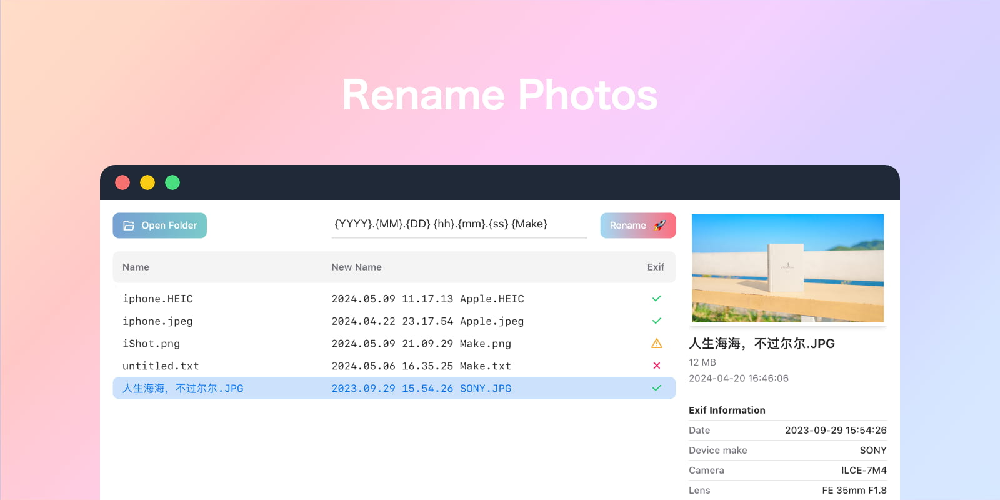

<div align="center">



<h1>Rename Photos</h1>

English / [简体中文](./README_CN.md)

A cross-platform desktop-app for renaming photos using EXIF data

Compatible with videos that include metadata like `Date`, `Make`, `Camera`

</div>

## Download

A compact bundle size of just 4MB:

- [MacOs (Apple silicon)](https://github.com/Arman19941113/rename-photos/releases/download/v0.1.2/Rename.Photos_0.1.2_aarch64.dmg)
- [MacOs (Intel silicon)](https://github.com/Arman19941113/rename-photos/releases/download/v0.1.2/Rename.Photos_0.1.2_x64.dmg)
- [Windows](https://github.com/Arman19941113/rename-photos/releases/download/v0.1.2/Rename.Photos_0.1.2_x64_en-US.msi)
- [Linux](https://github.com/Arman19941113/rename-photos/releases/download/v0.1.2/Rename.Photos_0.1.2_amd64.deb)

## Q & A

### Supported image formats?

Using [exif-rs](https://github.com/kamadak/exif-rs) to parse EXIF data:

- TIFF and some RAW image formats based on it
- JPEG
- HEIF and coding-specific variations including HEIC and AVIF
- PNG
- WebP

### MacOS: App is damaged and can't be opened?

Code signing is expensive, open Terminal and then enter the following command to fix this issue:

```bash
sudo xattr -d -r com.apple.quarantine /Applications/Rename\ Photos.app
```

### Is this app safe?

- Open source
- Only rename files
