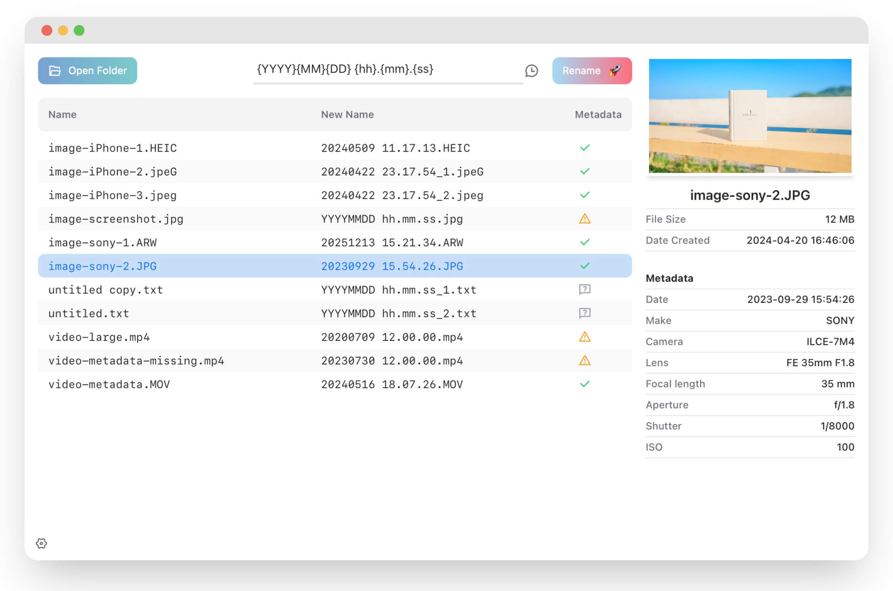

# Rename Photos

A cross-platform desktop application primarily focused on renaming photos and videos using metadata.

## Download

A compact bundle size of just 4MB: [Download the latest release](https://github.com/Arman19941113/rename-photos/releases/latest)

## macOS: “Rename Photos” is damaged and can’t be opened

Rename Photos is currently distributed without Apple notarization, so macOS may block it after download.

If you downloaded the app from the official GitHub Releases page and trust the source, you can remove the quarantine attribute with:

```bash
sudo xattr -dr com.apple.quarantine "/Applications/Rename Photos.app"
```
