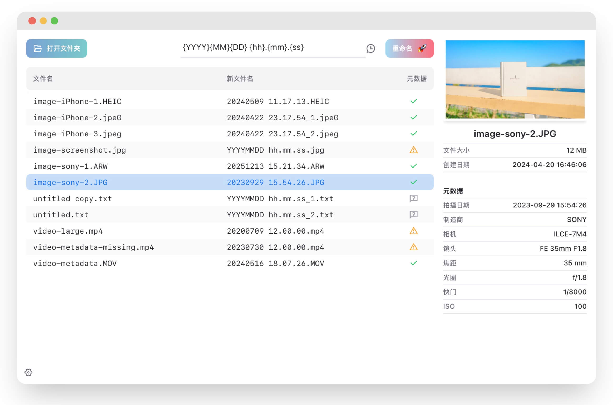

# Rename Photos

一个主要专注于根据元数据对照片和录像进行重命名的跨平台桌面端软件。

## 下载

软件安装包仅 4MB 左右：[下载最新版本](https://github.com/Arman19941113/rename-photos/releases/latest)

## macOS：提示“Rename Photos 已损坏，无法打开”

Rename Photos 目前没有经过 Apple 公证，因此 macOS 可能会在下载后阻止打开。

如果你确认应用来自官方 GitHub Releases 页面，并且信任该来源，可以通过以下命令移除隔离标记：

```bash
sudo xattr -dr com.apple.quarantine "/Applications/Rename Photos.app"
```
