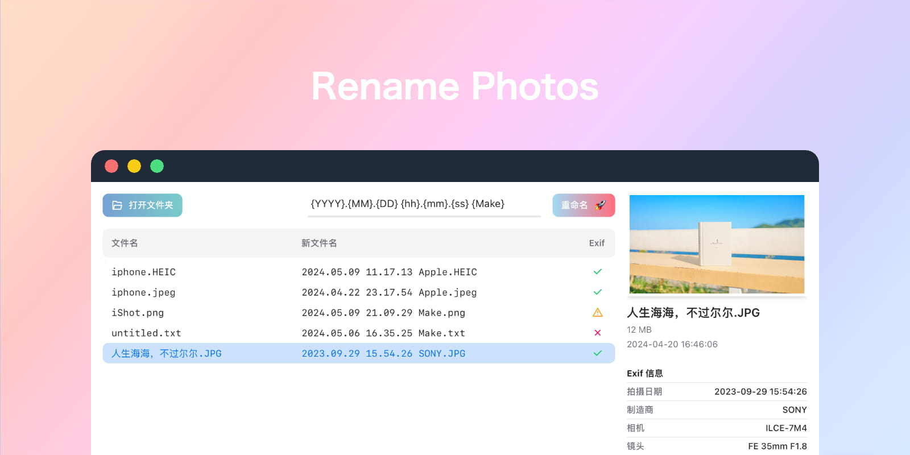

# Rename Photos

Rename Photos 是一个主要专注于照片重命名的跨平台桌面端软件，可以使用图片的 EXIF 数据来对文件进行重命名。

- 兼容含有相关元数据的视频文件，比如 `Date`, `Make`, `Camera`。
- 对于其他没有 EXIF 数据的文件，也可以使用日期相关的变量，相关数据从文件的创建日期中解析。

## 下载

软件安装包仅 6MB 左右：

- [MacOs (Apple silicon)](https://github.com/Arman19941113/rename-photos/releases/download/v0.1.2/Rename.Photos_0.1.2_aarch64.dmg)
- [MacOs (Intel silicon)](https://github.com/Arman19941113/rename-photos/releases/download/v0.1.2/Rename.Photos_0.1.2_x64.dmg)
- [Windows](https://github.com/Arman19941113/rename-photos/releases/download/v0.1.2/Rename.Photos_0.1.2_x64_en-US.msi)
- [Linux](https://github.com/Arman19941113/rename-photos/releases/download/v0.1.2/Rename.Photos_0.1.2_amd64.deb)

## Q & A

### 支持的图片格式？

使用 [exif-rs](https://github.com/kamadak/exif-rs) 解析 EXIF 数据:

- TIFF and some RAW image formats based on it
- JPEG
- HEIF and coding-specific variations including HEIC and AVIF
- PNG
- WebP

### MacOS：软件已损坏，无法打开？

代码签名很贵，打开终端输入以下命令可以解决这个问题：

```bash
sudo xattr -d -r com.apple.quarantine /Applications/Rename\ Photos.app
```

### 软件是否安全？

- 代码开源
- 只做一件事情：文件重命名
